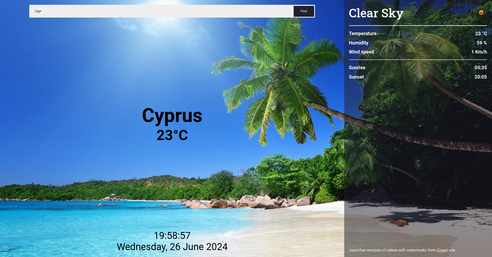

## Weather App
You can check weather of current location by coordinates, or search some location.

## Install

```sh
npm init
```

```sh
npm start
```

## Demo
<a href="https://soltonanna.github.io/weather/" target="_blank"> Demo </a>
